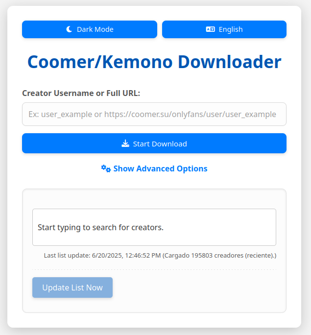

# Coomer and Kemono Scraper / Downloader

A scraper to download some or all media from coomer.su and kemono.su (previously coomer.party and kemono.party) uploaded by a specified artist using a multithreading orchestrator in Python.


## Usage

The easiest route is to download the latest release for your platform, run the executable, and follow the prompts.
If a release is not available for your platform, follow the platform agnostic approach.

### Submodule Dependency

Before using the platform agnostic command below, you must initialize the scraping_utils submodule. To do this, run the following command while in the repository directory: git submodule update --init

### Requirements

In its current state, this scraper requires the requests package. You can install this requirement by executing the following command in the repository directory:
python3 -m pip install -r requirements.txt

### Execution Command

```

usage: scrape.py [-h] [--out OUT] [--sub-folders] [--skip-vids] [--skip-imgs] [--confirm]
                 [--full-hash] [--offset-start START] [--offset-end END]
                 url

Coomer and Kemono scraper

positional arguments:
  url                   coomer or kemono URL or multiple URLs to scrape media from

optional arguments:
  -h, --help            show this help message and exit
  --out OUT             output directory (default: ./out)
  --sub-folders         create subfolders for each creator
  --skip-vids           skip video files
  --skip-imgs           skip image files
  --confirm             confirm parameters and start scrape without prompt
  --full-hash           use full file hash in filename (slower, ideal for low bandwidth)
  --offset-start START  start downloading from this post number (1-indexed)
  --offset-end END      end downloading at this post number (1-indexed)

```


## How to Use the Web Interface

This application also provides a user-friendly web interface (frontend) for easy interaction.
1. Accessing the Application
Once your Flask backend (app.py) is running, open your web browser and navigate to the address where the application is hosted (e.g., http://127.0.0.1:5000/ if running locally).
2. Searching for Creators
Search Bar: Use the main input field at the top of the page. Start typing a creator's name.
Live Search: As you type (after at least 2 characters), the application will display a list of matching creators below the search bar.
Creator Cards: Each matched creator will appear as a card (banner) showing their avatar, name, and service.
3. Interacting with Creator Cards
Open Creator Page: Click anywhere on the creator's banner/card (excluding the "Download" button) to open their profile page on Coomer.su (or Kemono.su) in a new browser tab.
Note for Fansly Creators: For Fansly creators, the URL opened will use their numeric ID (e.g., https://coomer.su/fansly/user/FANS_LY_ID_NUMBER), as this is how their profiles are structured on Coomer.su. For other services (OnlyFans, Patreon, etc.), the URL will use the creator's username (e.g., https://coomer.su/onlyfans/user/EXAMPLE_CREATOR_USERNAME).
Start Automatic Download: Click the "Download" button (↓ Download) located on the right side of a creator's card. This action will:
Automatically populate the main input field with the creator's name (or ID for Fansly).
Automatically initiate the download process using the populated details and any advanced options you have set.
4. Manual Download via Main Input
You can also manually enter information into the main input field:
Creator Username: Enter just the creator's username (e.g., a_generic_creator). In this case, ensure you select the correct Domain (coomer.su or kemono.su) and Service (OnlyFans, Fansly, Patreon, etc.) using the dropdown menus in the advanced options.
Full URL: Enter the complete URL of the creator's page (e.g., https://coomer.su/fansly/user/FANS_LY_ID_NUMBER or https://coomer.su/onlyfans/user/ANOTHER_CREATOR_NAME). The application will attempt to parse the domain and service from the URL.
After entering the information, click the "Start Download" button.
5. Advanced Options
Click "Show Advanced Options" to reveal additional settings:
Download Directory: Specify where downloaded files will be saved.
Subfolders: Choose to create subfolders for each creator.
Skip Videos/Images: Opt to skip certain file types.
Full Hash: Enable full hash calculation for integrity verification (may be slower).
Offset Start/End: Define a range of posts to download.
6. Monitoring and Stopping Downloads
Progress Bar & Status: Once a download starts, a progress bar and status messages will appear to indicate the current state of the scraping process.
Stop Button: Click the "Stop Download" button to attempt to terminate an ongoing download.
7. Updating the Creator List
Last Updated Status: Below the search bar, you'll see information about when the creator list was last updated.
Update List Now Button: Click this button to manually trigger an update of the creator list from the Coomer/Kemono API. This runs in the background and ensures your search results are always fresh. A loading bar will appear to indicate the update is in progress.
8. Theme Toggle
Use the "Dark Mode" / "Light Mode" button to switch between light and dark themes for the interface. Your preference will be saved for future visits.




## A Note on Scraping

This version is confirmed to work as of June 20, 2025. This approach uses the API when possible, which increases the reliability that it will continue to work in the future. Nevertheless, if you encounter any problems, please open an issue.

## Disclaimer

The website that this scraper targets is known to host media that is taken from many pay-per-view services without the consent of the original owner. By accessing this website (through a web browser or this tool), you are willfully viewing this stolen media. The user of the scraper is fully responsible for any consequences that may occur from these actions, and the developer(s) of this scraper does not assume responsibility for how the user chooses to act.

## Donate

If you enjoy this project and want to support its continued development, you can buy me a coffee with Bitcoin :)


```
bc1qqk258k94fwrc6kdj4jgjdkd0dumw2ncmvg6u7j

```

